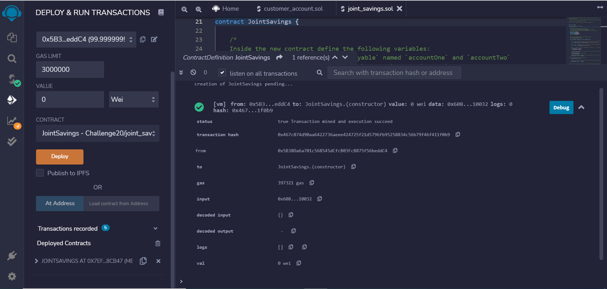
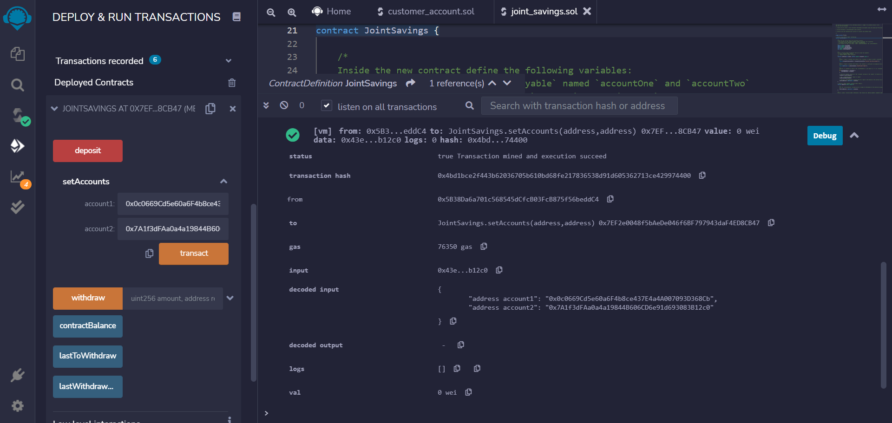
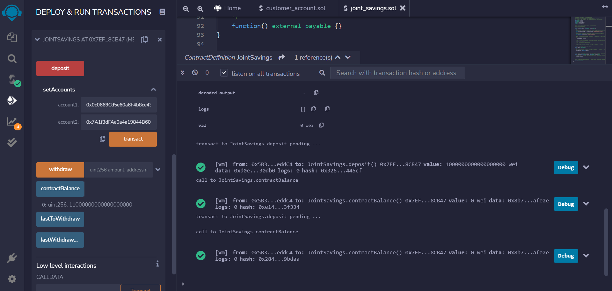
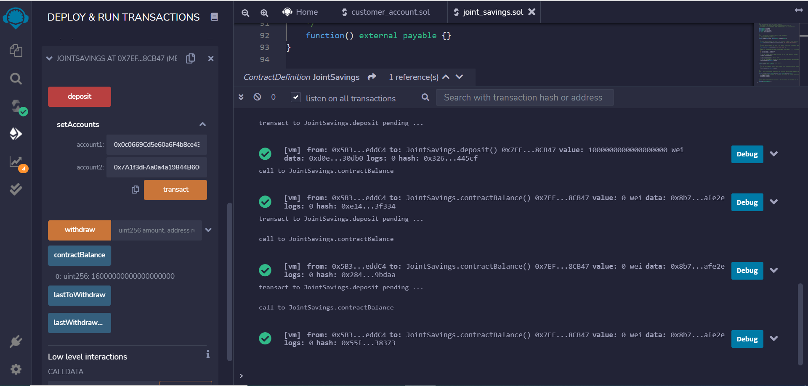
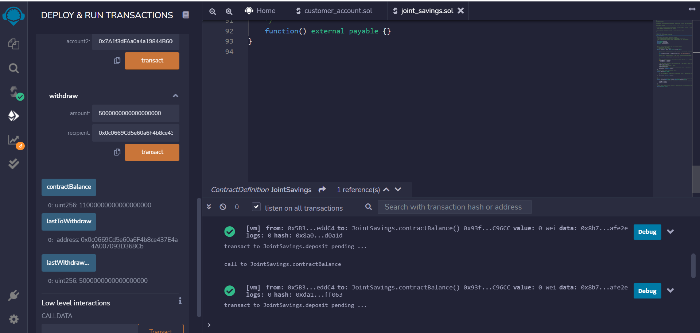
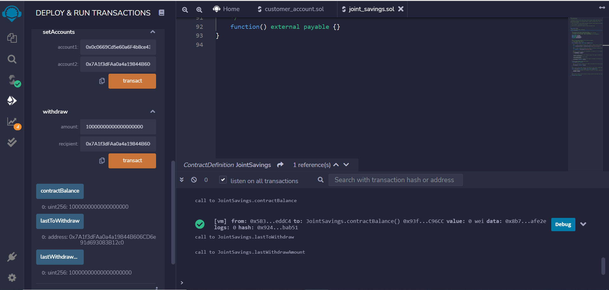

# Challenge20

## Deploying the contract

## Setting account addresses

## First deposit: 1 ETH

## Second deposit: 10 ETH

## Third deposit: 5 ETH

## Withdraw 5 ETH from account1

## Withdraw 10 ETH from account2

